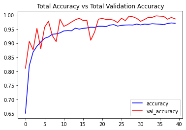
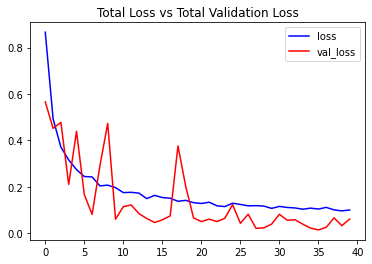

# Video Classification using Single Frame CNN 

Here we have a build a video classifier to un-seen videos. We have used a single frame CNN method to classify the videos, and due limitation in computational power, we are able to trained this model on a very less number of videos and classes. Our model is able to attain **an accuracy of about 98%** on the test set.

## Dataset

The dataset we are using is [UCF50 - Action Recognition Data Set](https://www.crcv.ucf.edu/data/UCF50.php)

UCF50 is an action recognition dataset which contains:

- 50 Action Categories consisting of realistic YouTube videos
- 25 Groups of Videos per Action Category
- 133 Average Videos per Action Category
- 199 Average Number of Frames per Video
- 320 Average Frames Width per Video
- 240 Average Frames Height per Video
- 26 Average Frames Per Seconds per Video


To download the dataset, run the following command:

```
!wget -nc --no-check-certificate https://www.crcv.ucf.edu/data/UCF50.rar
```
and then to extract the rar file, run the following command :

```
!unrar x UCF50.rar -inul -y
```

Here, due limitation in computation power, we are building a classifier to classify only four classes, and those classes are :
- Walking With Dog 
- TaiChi 
- Swing 
- Horse Race

## Single Frame CNN


In single-frame CNN, , we will run an image classification model on every single frame of the video and then average all the individual probabilities to get the final probabilities vector. This approach does perform really well, and we implement it in this UCF50 dataset.

## Model

To train the model, run the following command:

```
python train.py
```

To test the model (using pre-trained or your own trained model), run the following command:

```
python predict_video.py
```

## Results





